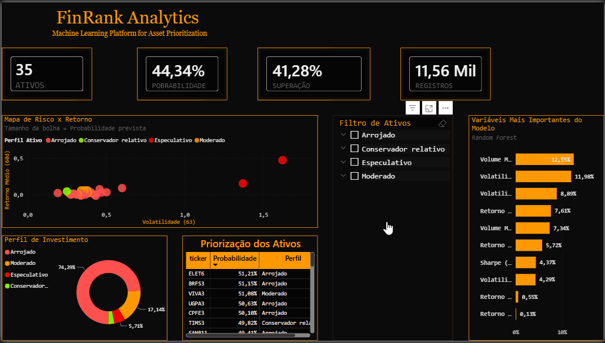
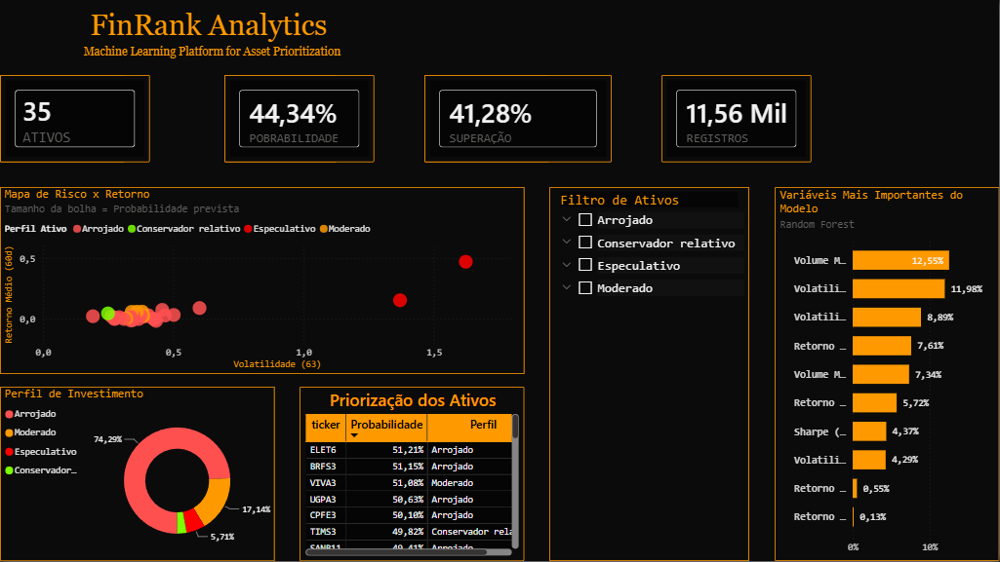

# 📈 FinRank Analytics


### Machine Learning Platform for B3 Asset Prioritization

Projeto completo de Ciência de Dados voltado ao mercado financeiro, desenvolvido para priorizar ativos da B3 utilizando Machine Learning, engenharia de atributos financeiros e visualização interativa em Power BI.

> **Objetivo:** transformar dados históricos em uma ferramenta de apoio à decisão para análise e priorização de ativos.

---

# 🎥 Demonstração

<p align="center">



</p>

---

# 📊 Dashboard

<p align="center">



</p>

---

# 🎯 Problema de Negócio

O mercado financeiro disponibiliza centenas de ativos para análise.

Avaliar manualmente risco, retorno, liquidez e comportamento histórico demanda tempo e dificulta a identificação dos ativos com maior potencial.

O **FinRank Analytics** foi desenvolvido para atuar como uma camada inteligente de priorização, auxiliando analistas e investidores a identificar quais ativos merecem maior atenção com base em dados históricos e modelos de Machine Learning.

---

# 🚀 Principais Funcionalidades

- 📈 Ranking probabilístico de ativos
- 🤖 Modelagem utilizando Machine Learning
- 📊 Dashboard interativo em Power BI
- 📉 Mapa de Risco × Retorno
- 🎯 Classificação por Perfil de Investimento
- 🧠 Explicabilidade do modelo através de Feature Importance
- 📋 Exploração dinâmica utilizando filtros

---

# 🧠 Arquitetura da Solução

```text
          Dados Históricos da B3
                     │
                     ▼
           Coleta e Tratamento
                     │
                     ▼
          Engenharia de Atributos
                     │
                     ▼
        Treinamento dos Modelos
      (Logistic Regression,
      Decision Tree,
      Random Forest)
                     │
                     ▼
          Avaliação Comparativa
                     │
                     ▼
      Ranking Probabilístico
                     │
                     ▼
      Dashboard Executivo Power BI
```

---

# 🛠 Tecnologias Utilizadas

| Categoria | Tecnologias |
|------------|-------------|
| Linguagem | Python |
| Manipulação de Dados | Pandas • NumPy |
| Machine Learning | Scikit-Learn |
| Visualização | Matplotlib • Power BI |
| Versionamento | Git • GitHub |

---

# 📂 Estrutura do Projeto

```text
FinRank-B3
│
├── data/
│   ├── raw/
│   ├── processed/
│
├── notebooks/
│   ├── analise_exploratoria.ipynb
│   └── modelagem_machine_learning.ipynb
│
├── reports/
│   ├── tables/
│   └── images/
│
├── src/
│
├── images/
│   ├── dashboard_finrank.png
│   └── dashboard_finrank.gif
│
├── FinRank_Analytics.pbix
│
├── requirements.txt
│
└── README.md
```

---

# 🤖 Modelos Avaliados

Durante o desenvolvimento foram comparados diferentes algoritmos supervisionados.

- Logistic Regression
- Decision Tree
- Random Forest

A escolha do modelo final foi baseada na comparação de métricas de classificação e capacidade de generalização.

---

# 📈 Principais Resultados

O projeto entrega uma visão integrada dos ativos através de:

- Ranking por probabilidade de superação do benchmark;
- Perfil de investimento dos ativos;
- Relação entre risco e retorno;
- Variáveis mais relevantes para o modelo;
- Dashboard executivo para exploração dos resultados.

---

# 📊 Dashboard Power BI

O dashboard completo está disponível no arquivo:

```text
FinRank_Analytics.pbix
```

---

# ▶️ Como Executar

Clone o repositório

```bash
git clone https://github.com/MateusSouto01/FinRank-B3.git
```

Instale as dependências

```bash
pip install -r requirements.txt
```

Execute os notebooks na ordem:

```text
1. analise_exploratoria.ipynb

2. modelagem_machine_learning.ipynb
```

---

# ⚠️ Aviso

Este projeto possui finalidade exclusivamente educacional e demonstra a aplicação de técnicas de Ciência de Dados ao mercado financeiro.

Os resultados apresentados não constituem recomendação de investimento.

---

# 👨‍💻 Autor

**Mateus de Oliveira Souto**

Cientista de Dados

- Python
- Machine Learning
- Power BI
- Análise de Dados

GitHub:
https://github.com/MateusSouto01

LinkedIn:
(seu LinkedIn)
