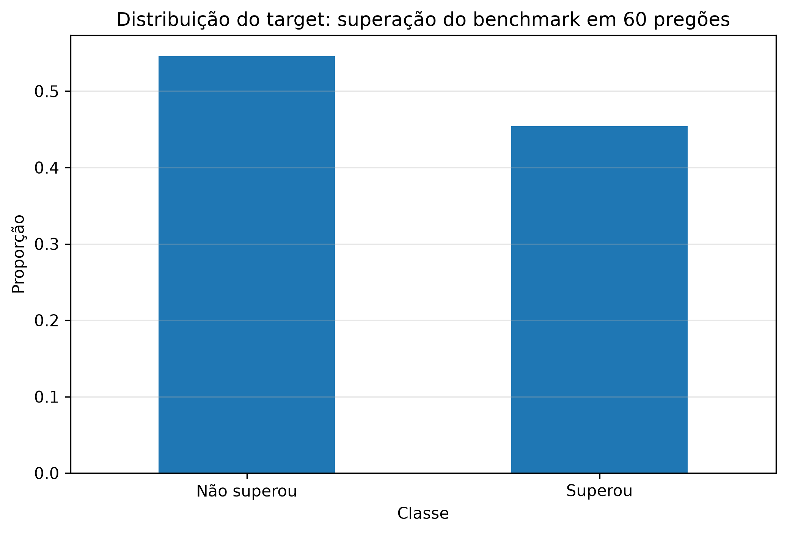
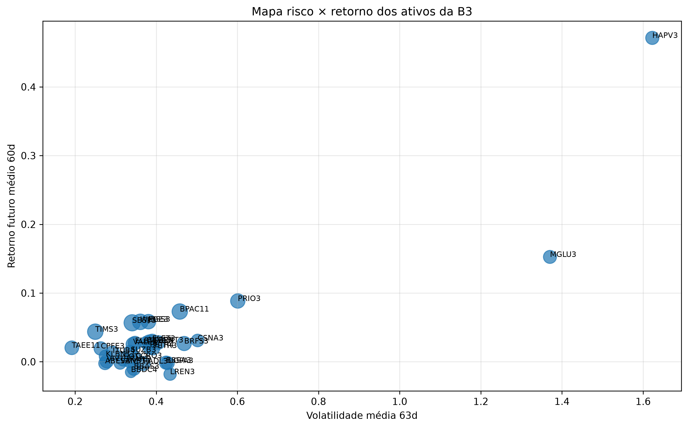
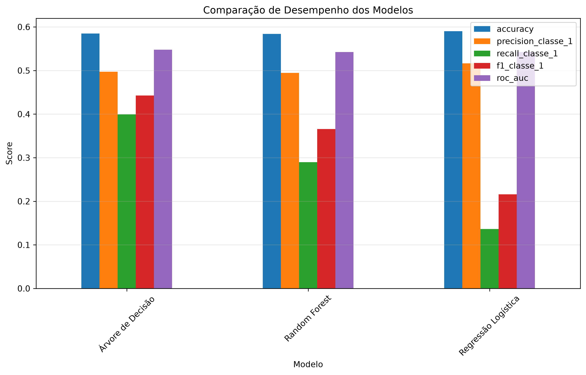
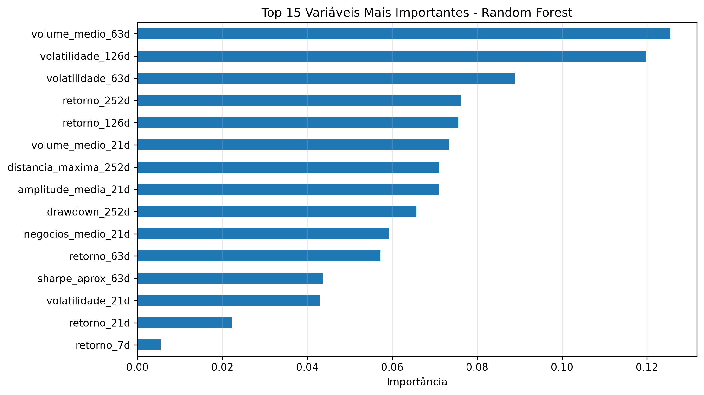
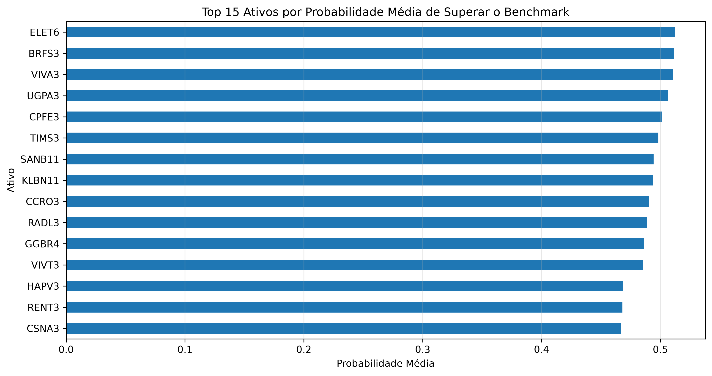
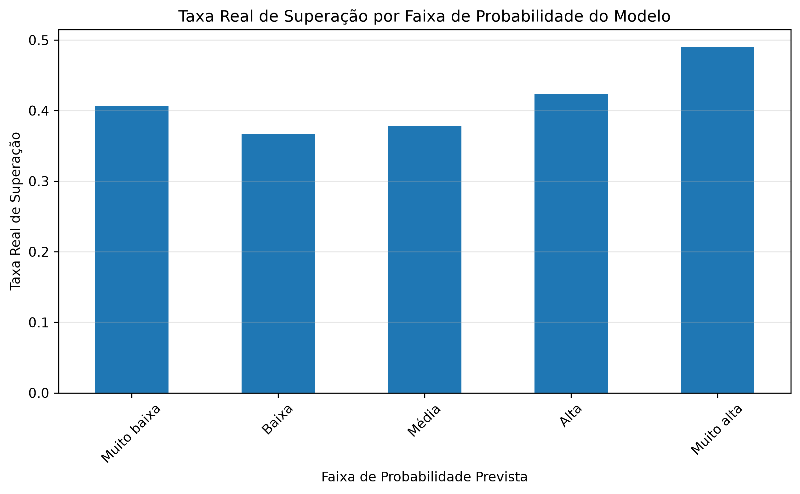

# FinRank B3: Sistema de Priorização de Ativos com Machine Learning

## 1. Sobre o projeto

Este projeto foi desenvolvido para o **Projeto de Parceria Semantix**, dentro da formação de Ciência de Dados.

A ideia aqui foi trabalhar com um problema mais próximo do mercado financeiro real, especialmente pensando em **fintechs, corretoras digitais e plataformas de investimento**.

Em vez de tentar criar um “robô mágico” que prevê preço de ação — o que seria uma promessa fraca e pouco realista — o objetivo foi construir uma solução de **apoio à decisão** para priorizar ativos da B3 com base em dados históricos, risco, liquidez e probabilidade de superar um benchmark.

O projeto usa dados públicos da B3 e aplica análise exploratória, engenharia de atributos, regras de suitability e modelos de machine learning para responder uma pergunta central:

> Quais ativos da B3 apresentam maior probabilidade de superar o benchmark em uma janela futura de 60 pregões, considerando também risco e liquidez?

Este projeto **não é recomendação de investimento**. A proposta é mostrar como dados podem apoiar uma fintech ou corretora na triagem, classificação e priorização de ativos.

---

## 2. Problema de negócio

Fintechs e corretoras digitais lidam com um desafio importante: oferecer produtos de investimento de forma personalizada, sem ignorar o perfil de risco do investidor.

Nem todo ativo serve para todo cliente.

Um ativo pode ter retorno alto, mas também pode ter:

- volatilidade elevada;
- drawdown forte;
- baixa liquidez;
- comportamento muito especulativo.

Por isso, o problema de negócio foi definido assim:

> Como construir uma camada analítica que ajude uma fintech a identificar ativos com maior potencial de superar o benchmark, sem olhar apenas para retorno bruto?

A solução proposta combina:

- análise de retorno;
- análise de risco;
- liquidez;
- drawdown;
- classificação de perfil dos ativos;
- machine learning supervisionado;
- ranking probabilístico.

---

## 3. Objetivos

### Objetivo principal

Criar um modelo de machine learning capaz de estimar se um ativo da B3 tende a superar o benchmark nos próximos 60 pregões.

### Objetivos específicos

- Coletar dados públicos da B3.
- Tratar e estruturar os dados brutos.
- Criar variáveis financeiras a partir dos preços e volumes.
- Analisar risco, retorno, liquidez e drawdown dos ativos.
- Criar uma classificação heurística de perfil de risco dos ativos.
- Treinar modelos de classificação binária.
- Comparar os modelos usando métricas adequadas.
- Criar um ranking probabilístico de ativos.
- Gerar gráficos e tabelas para apoiar a interpretação dos resultados.

---

## 4. Fonte de dados

A principal fonte utilizada foi a série histórica da B3 no formato **COTAHIST**.

Os dados foram baixados, processados e transformados em uma base de modelagem contendo informações como:

- data do pregão;
- ticker;
- preço de abertura;
- preço máximo;
- preço mínimo;
- preço médio;
- preço de fechamento;
- número de negócios;
- quantidade negociada;
- volume negociado.

A base final usada na modelagem ficou com:

- **57.200 observações**;
- **35 colunas**;
- **35 ativos**;
- período de **2019-01-11 até 2025-10-22**.

O histórico começa em 2019 na base final porque algumas features usam janelas longas, como retorno de 252 pregões e drawdown anual.

---

## 5. Estrutura do projeto

```text
projeto-semantix-fintech-b3/
│
├── README.md
├── requirements.txt
├── .gitignore
│
├── data/
│   └── processed/
│       ├── b3_features.csv
│       ├── b3_features.parquet
│       ├── b3_universo_modelagem.parquet
│       └── b3_cotacoes_mercado_vista.parquet
│
├── notebooks/
│   ├── analise_exploratoria.ipynb
│   └── 03_modelagem_machine_learning.ipynb
│
├── src/
│   ├── download_b3.py
│   ├── parse_b3.py
│   ├── create_universe.py
│   └── create_features.py
│
├── images/
│   ├── distribuicao_target.png
│   ├── mapa_risco_retorno.png
│   ├── comparacao_modelos.png
│   ├── feature_importance_random_forest.png
│   └── ...
│
└── reports/
    └── tables/
        ├── comparacao_modelos.csv
        ├── ranking_ativos_probabilidade_teste.csv
        ├── perfil_ativos_suitability.csv
        └── ...
```

---

## 6. Pipeline do projeto

O projeto foi dividido em quatro grandes etapas.

### 6.1 Coleta dos dados

A coleta dos arquivos COTAHIST da B3 é feita pelo script:

```bash
python src/download_b3.py
```

Esse script baixa os arquivos anuais da B3 e salva os dados brutos localmente.

Os arquivos brutos não são enviados para o GitHub porque são pesados e podem ser recriados a partir dos scripts.

### 6.2 Tratamento dos dados

O tratamento inicial é feito por:

```bash
python src/parse_b3.py
```

Essa etapa lê os arquivos de largura fixa da B3, converte datas, preços, volumes e salva uma base processada.

### 6.3 Seleção do universo de ativos

O universo de ativos é criado com:

```bash
python src/create_universe.py
```

A ideia foi trabalhar com ativos líquidos e conhecidos da B3, incluindo diferentes setores do mercado.

### 6.4 Engenharia de atributos

As features são criadas com:

```bash
python src/create_features.py
```

Foram criadas variáveis como:

- `retorno_1d`
- `retorno_7d`
- `retorno_21d`
- `retorno_63d`
- `retorno_126d`
- `retorno_252d`
- `volatilidade_21d`
- `volatilidade_63d`
- `volatilidade_126d`
- `volume_medio_21d`
- `volume_medio_63d`
- `negocios_medio_21d`
- `amplitude_media_21d`
- `drawdown_252d`
- `distancia_maxima_252d`
- `sharpe_aprox_63d`

---

## 7. Variável alvo

A variável alvo do projeto foi:

```text
target_supera_benchmark_60d
```

Ela indica se o ativo superou o benchmark em uma janela futura de 60 pregões.

```text
1 = ativo superou o benchmark
0 = ativo não superou o benchmark
```

A lógica usada foi:

```text
target = 1 se retorno futuro do ativo em 60 pregões > retorno futuro do benchmark em 60 pregões
target = 0 caso contrário
```

Essa escolha evita tentar prever o preço exato de uma ação, que é uma tarefa muito ruidosa.

Em vez disso, o modelo tenta responder uma pergunta mais útil para uma fintech:

> Este ativo tem chance de performar melhor que o mercado em uma janela futura?

---

## 8. Análise exploratória

A análise exploratória buscou entender o comportamento dos ativos antes da modelagem.

Foram analisados:

- distribuição da variável alvo;
- ativos que mais superaram o benchmark;
- retorno médio futuro;
- volatilidade média;
- liquidez média;
- drawdown;
- relação risco x retorno;
- correlação entre variáveis.

### Distribuição do target

A base ficou relativamente balanceada:

| Classe | Proporção aproximada |
|---|---:|
| Não superou benchmark | 54,6% |
| Superou benchmark | 45,4% |

Esse equilíbrio é importante porque reduz o risco de o modelo aprender apenas a classe majoritária.



### Risco x retorno

Um dos gráficos principais do projeto foi o mapa de risco x retorno.

Ele mostra que alguns ativos com alto retorno médio também carregam risco elevado. Esse ponto é importante porque uma fintech não deve olhar apenas retorno bruto ao priorizar ativos.



### Drawdown

O drawdown foi usado como medida de “dor” do investidor.

Em termos simples, ele mostra o quanto um ativo caiu em relação à máxima recente.

Essa métrica é importante porque o investidor pessoa física nem sempre entende volatilidade, mas sente diretamente a carteira caindo.

---

## 9. Classificação de perfil dos ativos

Além da modelagem supervisionada, foi criada uma regra heurística para classificar os ativos em perfis de risco.

As categorias utilizadas foram:

- Conservador relativo;
- Moderado;
- Arrojado;
- Especulativo.

Essa classificação considera:

- volatilidade média;
- drawdown médio;
- taxa histórica de superação do benchmark.

A ideia não foi criar uma regra definitiva de suitability, mas sim aproximar o projeto de uma aplicação real de fintech/corretora, onde o ativo precisa ser compatível com o perfil do investidor.

---

## 10. Modelagem de machine learning

O problema foi tratado como uma tarefa de classificação binária.

Foram testados três modelos:

- Regressão Logística;
- Árvore de Decisão;
- Random Forest.

A separação entre treino e teste foi feita de forma temporal.

Isso é importante porque, em mercado financeiro, não faz sentido misturar aleatoriamente passado e futuro. O modelo precisa ser treinado com dados antigos e testado em dados mais recentes, simulando melhor um cenário real.

---

## 11. Métricas utilizadas

As métricas avaliadas foram:

- Accuracy;
- Precision da classe 1;
- Recall da classe 1;
- F1-score da classe 1;
- ROC-AUC.

A classe mais importante é a classe `1`, que representa ativos que superaram o benchmark.

Neste contexto, a precision da classe 1 responde:

> Quando o modelo diz que um ativo tem chance de superar o benchmark, quantas vezes ele acerta?

O recall da classe 1 responde:

> De todos os ativos que realmente superaram o benchmark, quantos o modelo conseguiu capturar?

---

## 12. Resultados dos modelos

| Modelo | Accuracy | Precision classe 1 | Recall classe 1 | F1 classe 1 | ROC-AUC |
|---|---:|---:|---:|---:|---:|
| Regressão Logística | 0.5903 | 0.5162 | 0.1365 | 0.2159 | 0.5425 |
| Árvore de Decisão | 0.5849 | 0.4973 | 0.3992 | 0.4429 | 0.5477 |
| Random Forest | 0.5841 | 0.4945 | 0.2899 | 0.3655 | 0.5422 |



---

## 13. Escolha do modelo

O modelo principal escolhido foi a **Árvore de Decisão**.

Apesar da Regressão Logística ter apresentado a maior precision da classe positiva, ela teve um recall muito baixo, ou seja, foi conservadora demais e perdeu muitas oportunidades.

A Árvore de Decisão apresentou o melhor equilíbrio geral, com:

- maior recall da classe 1;
- maior F1-score da classe 1;
- maior ROC-AUC.

Por isso, ela foi escolhida como modelo principal.

A Random Forest foi mantida como modelo auxiliar para:

- análise de importância das variáveis;
- geração de score probabilístico;
- ranking de ativos.

---

## 14. Importância das variáveis

A análise de importância das variáveis mostrou que as principais features estão ligadas a:

- liquidez;
- volatilidade histórica;
- retorno de médio/longo prazo;
- drawdown;
- distância da máxima recente.

Entre as variáveis mais relevantes apareceram:

- `volume_medio_63d`
- `volatilidade_126d`
- `volatilidade_63d`
- `retorno_252d`
- `retorno_126d`
- `volume_medio_21d`
- `drawdown_252d`



Essa parte foi um dos insights mais importantes do projeto.

O modelo indicou que movimentos de curtíssimo prazo, como retorno de 1 ou 7 dias, tiveram pouca relevância. Já variáveis estruturais, como liquidez, volatilidade e retorno acumulado, foram mais importantes.

Em outras palavras:

> O modelo não está olhando “barulho diário”; ele está capturando características mais estruturais dos ativos.

---

## 15. Ranking probabilístico

Além da classificação binária, foi criado um ranking por probabilidade média de superação do benchmark.

A ideia aqui é mais realista para uma fintech:

> Em vez de usar o modelo como botão de compra/venda, usar o score como filtro de priorização.

No conjunto de teste, os ativos com maior probabilidade média de superação foram:

| Ativo | Probabilidade média | Taxa real de superação |
|---|---:|---:|
| ELET6 | 0.5121 | 0.4554 |
| BRFS3 | 0.5115 | 0.3750 |
| VIVA3 | 0.5108 | 0.6250 |
| UGPA3 | 0.5063 | 0.2679 |
| CPFE3 | 0.5010 | 0.5565 |
| TIMS3 | 0.4982 | 0.6429 |
| SANB11 | 0.4941 | 0.4851 |
| KLBN11 | 0.4934 | 0.2411 |
| CCRO3 | 0.4907 | 0.2555 |
| RADL3 | 0.4889 | 0.3125 |



As probabilidades ficaram próximas, então a leitura correta não é “esse ativo vai ganhar com certeza”.

A leitura correta é:

> O modelo cria uma ordenação relativa de prioridade para análise.

---

## 16. Análise por faixa de probabilidade

Também foi feita uma análise agrupando as previsões em faixas:

| Faixa de probabilidade | Taxa real de superação |
|---|---:|
| Muito baixa | 0.4066 |
| Baixa | 0.3672 |
| Média | 0.3785 |
| Alta | 0.4234 |
| Muito alta | 0.4905 |

A faixa “Muito alta” apresentou a maior taxa real de superação.



Isso mostra que o modelo tem mais valor como ferramenta de ranqueamento do que como classificador binário rígido.

---

## 17. Principais conclusões

O projeto mostrou que é possível usar dados públicos da B3 para construir uma solução analítica voltada ao contexto de fintechs e corretoras digitais.

Os resultados mostram que existe algum sinal preditivo nas variáveis criadas, principalmente em métricas ligadas a:

- liquidez;
- volatilidade;
- drawdown;
- retornos de médio/longo prazo.

Ao mesmo tempo, os resultados também mostram que prever superação de benchmark em mercado financeiro é uma tarefa difícil e ruidosa.

Por isso, a conclusão principal não é que o modelo “prevê o mercado”.

A conclusão correta é:

> O modelo pode ser usado como uma camada de apoio à decisão, ajudando a priorizar ativos para análise, combinar filtros de risco e liquidez, e apoiar uma lógica de suitability em uma fintech.

---

## 18. Limitações

O projeto possui algumas limitações importantes:

- uso apenas de dados históricos de preço e volume;
- ausência de dados fundamentalistas;
- ausência de variáveis macroeconômicas;
- ausência de notícias, eventos corporativos e fluxo institucional;
- benchmark aproximado;
- modelos ainda simples;
- desempenho preditivo moderado.

Essas limitações são esperadas em um projeto inicial com dados públicos.

---

## 19. Próximos passos

Possíveis melhorias futuras:

- incluir dados fundamentalistas da CVM;
- incluir indicadores macroeconômicos, como Selic, IPCA, dólar e CDI;
- adicionar classificação setorial;
- testar modelos como XGBoost e LightGBM;
- aplicar validação walk-forward;
- calibrar probabilidades;
- criar um dashboard em Streamlit ou Power BI;
- simular uma carteira baseada no ranking do modelo;
- comparar a carteira simulada contra BOVA11 ou Ibovespa.

---

## 20. Como executar o projeto

### 20.1 Clonar o repositório

```bash
git clone <url-do-repositorio>
cd projeto-semantix-fintech-b3
```

### 20.2 Criar ambiente virtual

```bash
python -m venv .venv
```

Ativar no Windows:

```bash
.venv\Scripts\activate
```

### 20.3 Instalar dependências

```bash
pip install -r requirements.txt
```

### 20.4 Executar pipeline

```bash
python src/download_b3.py
python src/parse_b3.py
python src/create_universe.py
python src/create_features.py
```

### 20.5 Rodar notebooks

Abrir e executar:

```text
notebooks/analise_exploratoria.ipynb
notebooks/03_modelagem_machine_learning.ipynb
```

---

## 21. Tecnologias utilizadas

- Python
- Pandas
- NumPy
- Matplotlib
- Scikit-learn
- Random Forest
- Árvore de Decisão
- Regressão Logística
- Jupyter Notebook

---

## 22. Observação importante

Este projeto tem finalidade educacional e analítica.

Ele não representa recomendação de investimento, compra ou venda de ativos.

O foco é demonstrar aplicação de ciência de dados em um problema realista de mercado financeiro, com uso de dados públicos, análise exploratória, modelagem supervisionada e interpretação de resultados.

---

## 23. Autor

Projeto desenvolvido por **Mateus**, estudante de Ciência de Dados, com foco em aplicações de dados para mercado financeiro, fintechs, corretoras e tomada de decisão orientada por dados.
